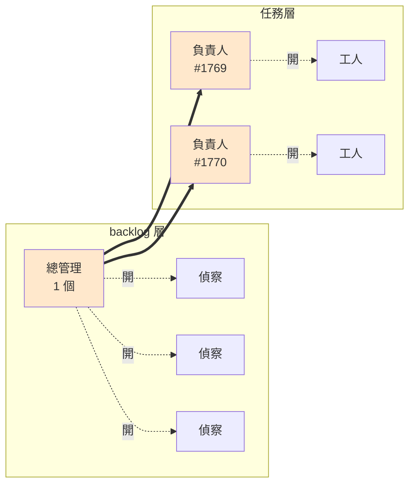

# Fleet：一次把 N 件事準備到可決策

**這份講架構與規則** —— 誰是誰、誰跟誰交接、你在哪裡停下來。

| 你要什麼 | 看哪裡 |
| --- | --- |
| 誰是誰、誰跟誰交接、你在哪介入 | **這份** |
| 某條規則當初為什麼這樣定 | [`docs/adr/`](./adr/) |
| issue／草稿 body 長什麼樣 | **目標 repo 自己的規範**（它的 `CLAUDE.md` 觸發表指過去）。這裡不留第二份 |
| 接單的機械動作 | `bin/fleet` —— **還沒寫**。在那之前手打，該打什麼見〈現況與待辦〉 |
| 跑一輪、邊跑邊打勾 | [`fleet-dry-run-checklist.md`](./fleet-dry-run-checklist.md) |

> 實測環境：Herdr 0.8.0、Claude Code 2.1.232、Ubuntu 24.04（WSL2）。

**理由要住在哪，用一個測試決定**：這行理由會改變 **agent 的行為**嗎？會 → 留在 SKILL.md
（例：「用 `info/exclude` 不用 `.gitignore`」的理由 —— 沒有它，agent 會很聰明地改用 `.gitignore`）。
只會改變**你的行為** → 住這份或 ADR（例：`merge --no-ff` 為什麼比 ff 好 —— agent 不會自己改成 ff）。
抄兩份的代價實際發生過：SKILL.md 曾經整段複述 ADR-0004 的論證，而 agent 讀了行為沒有任何差別。

---

## 這在解什麼問題

原本的流程是序列的：**待辦 → 我先過一層翻 repo 整理 context → 討論對齊 → 才動工。**

瓶頸不在寫 code，在「我先過一層」。拆開看它是兩件事：**翻 repo 確認現況**佔八成、**判斷這樣改對不對**佔兩成。前者能平行，後者不能，也不該 —— 拔掉那層就是垃圾進垃圾出。

**所以平行的是「把問題準備到可以決策的狀態」，不是實作。** 原本一天只能開始 2 件事，變成一天能對齊 8 件事的決策。複雜的實作還是一件一件來。

系統化實際換到的東西只有一個：**「查現況」從序列變平行，而你的判斷還是序列的。** 其他都是這件事的推論。

⚠️ 這裡原本寫的是「問答從 terminal 搬到 issue 上」。那條**退掉了** —— 對齊改成在 pane 裡直接談，
只有跨過今天的事才落 issue（見〈交接 3〉與[不變量 3](#三個不變量)）。

---

## 兩種角色

不要用「層數」理解這套。層數是實作細節（subagent、獨立 pane、它自己再開一層 orchestrator —— 都行，這份文件不管）。**真正的分界線是：你會不會跟它輪流講話。**

| 角色 | 誰 | 定義 | 你 |
| --- | --- | --- | --- |
| **管事的** | 總管理、負責人 | 有一個明確的管轄範圍，會停下來等你 | 講話 |
| **跑腿的** | 偵察、工人 | 交完就結束，怎麼做你看不到 | 不講話 |

**跑腿的規則**（共用，不因為誰派的而不同）：不介入、交完就停、**不改檔案**、結論寫進檔案不留在自己的 context 裡。

**管事的自己決定要開幾個跑腿的、怎麼開。** 這份文件不規定機制，只規定行為。層數也別再加：夠用了，而「太早加層」是最常見的錯。

### 跑腿的不對外做事

**不開 issue、不發訊息、不 push。** 產出寫成檔案，回一行路徑 —— 對外的動作一律由管事的做。沒有例外。

偵察一度是例外（它自己開 issue），改掉了。換到兩件事：**同一批裡面的重複擋得住**（N 個偵察平行查重時互相看不見，各自開就會開出重複的），而且**顆粒度在 issue 存在之前就決定得了**（想合併不用關掉一張已開的 issue）。→ [ADR-0006](./adr/0006-recon-writes-a-draft-not-an-issue.md)

---

## 兩層管轄

層數不是數 agent，是數**管轄範圍**。只有兩層，因為只有兩種人類決策：

| 層 | 誰 | 管什麼 | 你在這裡決定 |
| --- | --- | --- | --- |
| **backlog 層** | 總管理（1 個） | N 個任務 | 這件事**值不值得做** |
| **任務層** | 負責人（N 個，一個任務一個） | 1 個任務 | 這件事**怎麼做** |

工人不是一層，它是管事的內部實作。



橘色是你會講話的對象。**偵察和工人是同一種東西**，只是派它的人不同。

### 總管理：機械的進 script，判斷的留 agent

總管理大部分工作是機械的，那些應該進 `bin/fleet`（不會 goal drift）：spawn 偵察、收 issue 編號、貼 label、算改動範圍交集。

留給 agent 的判斷只有一件：**掃 Slack 那幾十列，挑出「敘述只有『功能…』看不懂在講什麼」的，讓你一次回問 PM。** 它只讀 Slack、不碰 repo，所以 context 極薄。

---

## 三個交接點

交接就是東西會掉的地方。每個交接寫清楚：**載體是什麼、會掉什麼、怎麼補。**

### 交接 1：待辦列 → 草稿（偵察寫檔）

| | |
| --- | --- |
| **載體** | 一份草稿檔（`drafts/<日期>/<短名>.md`，不進版控）。三格：**現況**（改動點列得完）＋ **怎樣算解完** ＋ **方向** |
| **會掉什麼** | 偵察查到但沒寫進草稿的東西，全部。它交完就死 |
| **怎麼補** | 補不了。所以判準很硬：**前兩格沒填 = 沒交件，退回去查**，不是標 ⚠️ |

**共用 checkout 只拿來偵察。要改檔案就開 worktree —— 沒有「順手在這裡改一下」。** 發生過一次：回頭在偵察的 pane 裡下了實作指令，4 個檔案被改掉，而另外 4 個偵察正在讀同一份工作區（讀到改一半的檔案就會產出錯的結論）。

**收工前 `git status --short`。** 不乾淨的話，那段時間寫的草稿錨點要重驗 —— `file:line` 可能指向未提交的狀態。守門擋得住兩種根因（人為和 agent 失控），但它只在事後抓得到，所以上面那條才是主藥。

**派工那句話只給 repo 外的東西。** repo 裡的它自己找得到（`CLAUDE.md` 是地圖，自動載入），你指路只會限制它，指錯它會很聽話地在錯的地方找。repo 外的它一輩子找不到（PM 需求文件、prototype、UI 稿）—— 那才是要給的。外部文件的路徑**登記在 `~/code/CLAUDE.md`，不要每次貼**。

**偵察不開 issue、不開 worktree、回覆只給一行路徑。** → [ADR-0006](./adr/0006-recon-writes-a-draft-not-an-issue.md)

**不要在這一步討論。** 討論的價值來自你手上已經有查好的現況，還沒查完就談等於回到那個爛順序；而且 N 個平行、每個都想討論你就是一整天沒了。

### 你看草稿：兩條出口，當場選一條

草稿是**消耗品，不是第二套 backlog**。你 review 那一刻就二選一，不留「之後再說」——
留中間狀態，`drafts/` 就會長成第二套 backlog，那正是〈不用建 `backlog/` 目錄〉在防的事。

| | 出口 |
| --- | --- |
| **今天之內一個 agent 做得完** | 直接派工吃草稿，做完 `slack-list ready Rec… --changed … --verify …`，草稿刪掉。**不開 issue** |
| **跨天、會換手、要跟你談** | **開 issue**，走下面的交接 2 |

**為什麼當天做完的不需要 issue**：issue 給得起而草稿給不起的只有三樣 ——
**去重指紋**、**推導的長期存放**、**slug 的碰撞偵測**。三樣都只在「事情沒有一口氣做完」時才有價值：
指紋擋的是下一輪偵察又查到同一列、推導要留是因為談的人跟做的人不同、碰撞偵測擋的是你忘了已經在做。
一口氣做完的，那三欄一個都沒被用到。→ [ADR-0008](./adr/0008-same-day-work-skips-the-issue.md)

⚠️ **升級規則**：做到一半發現跨天了（要拆、PM 又補規格、你被叫去開會）——
**agent 就地把草稿當 body 開 issue，繼續做。** 走〈負責人發現新問題〉那條路，不用新機制。

⚠️ **你會判錯。** 判錯就是那件事在沒有 issue 的狀態下過夜，指紋沒埋，隔天偵察可能重複開一次。
升級規則救得回大部分，救不回「agent 死掉而你忘了」—— 那時候 Slack 那列還在表上、
狀態沒變成「PM確認中」，你下次掃表看得到。

### 交接 2：草稿 → 任務 → 負責人（開 issue → 接單）

這是最容易掉東西的一個。偵察坐在共用 checkout、實作要在 worktree ⇒ **一定會換 agent**（agent 的 cwd 在 spawn 那一刻就定死，herdr 的 `--cwd` 只在 `pane split`，`pane move` 不改 cwd）。

**派工那句話裡順便要它在草稿最後一行標一個籤，你 review 的其實是那個標籤。** 標錯了你馬上知道它沒搞懂，代價是兩分鐘，不是一個爛 diff。

⚠️ 這個標籤**沒有 skill 保證**（`fleet-recon` 已刪）—— 你要就講一句，不講就自己讀完草稿判。它省的不是那次閱讀，是**替你把「哪些要在開 issue 前談」先分好堆**：`⚠️ 範圍未定` 決定 slug 顆粒度，而那件事開了 issue 就不可逆。

| 標 | 意思 | 你做什麼 |
| --- | --- | --- |
| `✅` | 三格都填滿 | **開 issue ＋ 掛 `ready-for-agent`**（同一個動作，`bin/fleet` 做） |
| `⚠️ 範圍未定` | 方向會改變**要開幾個任務**或**動到哪些檔案** | **開 issue 前**就要談，談完直接改草稿。此刻還沒有 worktree 可開，就在 backlog 層談 |
| `⚠️ 做法未定` | 方向只改實作走法，範圍不變 | 帶著空格開 issue。接單後由負責人跟你談 —— **跟一般任務同一關**，只是要談的東西多一格 |

**只有「方向」那格可以空。** 現況空了 → 接單的人得重查一遍，偵察白做。怎樣算解完空了 → 接單的人不知道什麼時候算做完，而且這欄會一路流到 PM 驗收（`bin/slack-list ready --verify` 用的是同一份）。

**為什麼要拆兩種：** 「合成一個還是拆兩個」必須在開 issue 那一刻決定，因為 **issue 編號就是 slug**（[不變量 1](#三個不變量)）。接單後才談，slug 已經定死了。

**談完的那個 agent 就是負責人，一路做到底。** 推導（「B 為什麼在第三輪被排除」）活在它的 context 裡，而那正是實作撞牆時要用的東西。→ [ADR-0007](./adr/0007-align-inside-the-worktree-and-never-hand-off.md)

⚠️ **真的要換手時，載體是 handoff 檔，不是 issue comment。** comment 帶得走「選了 A」，帶不走推導；handoff 檔是整段對話的壓縮，它帶得走。ADR-0007 原本從「comment 帶不走推導」推到「不換 agent」，那步的隱含前提是「交接載體只能是 comment」—— 前提破了，結論就只剩「**別用 comment 換手**」。→ [ADR-0013](./adr/0013-alignment-replaces-plan-review.md)

**開 issue 前順手看一眼改動範圍有沒有交集。** 三份草稿都要改 `inventory/export.js`，一起開就是三個 worktree 各改各的，merge 時全撞。有交集的：要嘛合成一份，要嘛排隊。**這時候合併不用關掉任何 issue** —— 這正是把開 issue 收到 backlog 層換到的東西。（`bin/fleet` 可以直接算，那欄本來就是機械檢查。）

**label 維持兩態**：沒有 label ＝ 還沒過目；`ready-for-agent` ＝ 可以派工。走草稿這條路開出來的 issue 一出生就有 label（你已經看過草稿了）；沒 label 的只有負責人衍生出來的那些。

### 交接 3：負責人 → 驗收（merge 進整合分支）

一個模組一條長命的整合分支（例如 `fix/inventory`），所有 worktree 從它開、做完 merge 回它，最後由它對 `dev` 開一個 PR。

**接單的 agent 讀完 issue，白話講幾句它理解的是什麼，然後停在 pane 裡等你。** 不寫 issue comment —— 那份 comment 沒有讀者，你要談的話會直接進去談。`herdr agent list` 裡 **`agent_status` 不是 `working`** 的那幾個就是你的待談清單。

⚠️ **不要只挑 `idle`。** 接單是 `--no-focus` 起的，tab 沒被看過的話狀態是 `done` 而不是 `idle`（同一個底層狀態，herdr 用它區分「背景做完但你還沒看到」），而 CLI 讀取不會把 tab 標記成看過。只挑 `idle` 會漏掉剛 bootstrap 完的那批。判準看 herdr skill 的狀態定義，不要在這裡重寫一份。

**談完就實作，不用先總結。** 共識活在那個 agent 的 context 裡；它一路做到底、不換手，所以推導不需要載體。→ [ADR-0013](./adr/0013-alignment-replaces-plan-review.md)

要留紀錄的時機只有兩個，而且都是你當場的決定，不是 agent 的步驟：

| 時機 | 載體 |
| --- | --- |
| **要換手**（這個 agent 收不掉） | handoff 檔，寫在 worktree 裡並用 `info/exclude` 忽略 —— 不是 `/tmp`（`handoff` skill 的預設會跟著重開機消失） |
| **跨過今天**（要拆、PM 又補規格、你被叫去開會） | issue comment，連推導一起寫 |

⚠️ **不要預先總結。** 為還沒發生的未來寫摘要，每個任務都在付這個成本，而多數任務兩個時機都不會到。真的到了你講一句它就寫。

> 這關看的是「**它有沒有理解對**」，不是「這是最好的做法嗎」。理解對就放行 —— 簡單的一句話 10 秒過、複雜的談半小時，成本自動隨複雜度縮放，所以不用挑哪個要審。
>
> 它不能用「issue 已經寫了改動範圍」取代：issue 說的是**改哪些檔案**，談的是**怎麼改**。方向對、範圍對，做法照樣可以歪。

**兩道關**：agent 自己過測試 / lint / typecheck ＋ `git diff --name-only` 對照範圍，才輪到第二道。

**第二道關是「驗收」，不是「人測」** —— 判準只有一個：**任務上寫的「怎樣算解完」有沒有達成。** 執行者可以是 e2e（功能對不對、流程有沒有斷，有覆蓋就該讓它擋）或你（UI/UX 的主觀判斷，這個目前沒得外包）。現在大部分是你手測，那是現況不是原則。

**規則：**

| 規則 | 反過來會怎樣 |
| --- | --- |
| 驗收只在整合分支，**一次只 merge 一件** | 兩件一起併進去壞掉，你不知道是誰 |
| **dev server 只開一個**（worktree 裡不開） | 你的注意力本來就一次一件。worktree 的價值在「agent 同時在寫」，不在「你同時在測」 |
| **`merge --no-ff`** | 一顆 merge commit 一個工作單位，整合測試掛掉時 `git revert -m 1 <sha>` 就打得回乾淨。→ [ADR-0005](./adr/0005-no-ff-merges-into-a-long-lived-integration-branch.md) |
| **測到問題回原 worktree 改，不要 revert** | revert 掉一顆 merge commit 之後再 merge 同一條 branch，**內容不會回來** —— git 判斷要併什麼是看歷史圖不是看內容，那些 commit 已經是祖先了，它認為沒有新東西。而「反掉」的那顆還在。要救得 revert 那顆 revert |
| **worktree 最後才收** | 整合測試沒過你要回去修，先收掉就得重開重裝 |
| **子 branch 一律不 push** | 會在 GitHub 累積一堆永遠不開 PR 的分支 |
| **其他還在跑的 worktree 不要動** | 在 agent 做到一半改它的 base，它腦裡的檔案狀態會跟磁碟對不上 |

### 負責人發現新問題：只開 issue，不自己接

做到一半發現「這其實是兩件事」或「還有一個沒人注意到的 bug」—— **開 issue，丟回 backlog 層，不准自己接**。自己接的話一個 worktree 兩個 slug，違反不變量 1。

**衍生任務第一行要寫「從 #1769 衍生」當指紋。** 一般任務的去重指紋是 Slack 的 `Rec…` record_id，衍生任務沒有 —— 母任務編號就是它的指紋。

---

## 三個不變量

違反其中任何一條，後面所有機制都失效。

### 1. 一個 slug 貫穿全部

slug ＝ **issue 編號 + 短名**，它同時決定 issue（`#1769`）、branch（`fix/1769-export-warehouse-only`）、worktree 路徑、herdr agent name。

**一個 slug 只准出現在一個 worktree，一個 worktree 只准有一個 agent。沒有例外。** → [ADR-0002](./adr/0002-one-slug-one-worktree-one-agent.md)

### 2. issue 是 backlog 的正本

跨過今天的事，正本一律是 issue —— 它同時是**交接載體**、**去重指紋**、**推導的長期存放**、**slug 的來源**。當天做得完的不進 backlog（見上面兩條出口）。

⚠️ **issue 不是 PM 看得到的介面。** PM 只看 Slack 那張表 —— `bin/slack-list` 整支沒有一個字提到 issue，回報全走 item 留言串（ADR-0001）。→ [ADR-0003](./adr/0003-issues-are-the-backlog-not-markdown-in-the-repo.md)

⚠️ **開 issue 的是 backlog 層，不是偵察。** 偵察平行跑的時候互相看不見對方查到什麼，各自查重、各自開，同一批裡的重複擋不住。

⚠️ **「讓 agent 自己開 issue」只有 Slack 那條入口是安全的**，因為只有它有 `Rec…` 指紋擋重複。PM 口述、順手發現的沒有 —— 那些要嘛你自己開，要嘛派工那句話得指定用什麼關鍵字搜。（衍生任務用母任務編號當指紋，見上。）

⚠️ **指紋要看得見，不要藏在 HTML 註解裡。** GitHub 搜尋會不會索引註解沒有定論，整套去重就靠 `gh issue list --search "Rec0B…" --state all` 這個查詢。

### 3. 要人決定的事，agent 停下來等；跨過今天的才落 issue

遇到要人決定的事 → **停**。停在 pane 裡，你在 herdr 看得到（`idle` / `blocked`）。

**問題落在哪裡由一個判準決定：這件事會不會跨過今天。**

| | 落在哪 | 為什麼 |
| --- | --- | --- |
| 這一輪談完就做掉 | pane 裡的對話 | 談完就實作，寫下來沒有讀者 |
| 會跨過今天 | issue comment，連推導一起寫 | compact 一次對話就蒸發，而三天後回頭看只有 issue |

⚠️ **`blocked` 跟 `idle` 都要當「該你了」，只等一個會漏。** `blocked` 是在等權限核可、`idle` 是話講完了。`herdr agent wait --until idle --until blocked` 是給「**做到一半**需要人」用的；接單後的停是確定會發生的，`herdr agent list` 看一眼就夠，不用 wait。

**真的該擋著等你的只有三種**：推 code、開 PR、動到別人的東西（改 Slack 表、關 issue）。**開** issue 不在裡面。

⚠️ **這條退掉了「批次回答」那個好處，而那是刻意的。** 原本的設計是計畫全寫進 issue、你坐下來一次看 N 份（[ADR-0004](./adr/0004-plans-go-into-issue-comments-not-interactive-approval.md)）。那張對照表現在讀起來還是對的，它只是輸在另一個代價上：**那些 comment 沒有讀者**，你會直接進去談。

批次其實沒有真的掉 —— 換了形式。接單後的停是**確定的**（bootstrap 完幾秒內），不是隨機打斷，所以 N 個可以全停在那裡等你一個一個談。ADR-0004 怕的是「10 個 agent 在 3 小時內隨機打斷你」，那個風險在這個停點不存在。→ [ADR-0013](./adr/0013-alignment-replaces-plan-review.md)

---

## 你的介入點

| 介入點 | 在哪一層 | 你在決定什麼 | 花多久 |
| --- | --- | --- | --- |
| **分流** | backlog | 這件事值不值得你花時間 | 30 秒 |
| **讀草稿** | backlog | 走哪條出口：當天做掉，還是開成任務 | 兩分鐘／份 |
| **對齊** | 任務 | 它有沒有理解對、方向挑哪個（只有 ⚠️ 才有） | 10 秒～談半小時 |
| **驗收** | 任務 | 「怎樣算解完」達成了沒 | 一次一件 |

偵察和工人你不介入 —— 那是刻意的。

### 分流：30 秒決定「值不值得你花時間做決定」

**這步不是在做決定，是在決定這件事值不值得你花時間。** 一句話版本：**答案在哪。**

| 答案在哪 | 怎麼處理 |
| --- | --- |
| 全在 repo 裡 | 直接派偵察。grep 比你快，不用給 context |
| repo ＋ 一個外部事實（後端行為、PM 文件、UI 稿） | 也派，但派工那句話要附上那個來源 |
| 看不懂在講什麼（`敘述` 只有「功能…」） | **回去問 PM。** 不是自己復現，也不是派 agent 猜 |
| 根本不該做 | 不進 issue，回 PM |

⚠️ **分流不查 repo。** 一旦要查就不叫分流了，那道「值不值得」的閘門會直接消失 —— 30 秒會變 30 分鐘。

**復現是兩件事，只有一件是你的**：在畫面上確認症狀存在是你的 30 秒（有 e2e 覆蓋就交給它 —— `frontend/e2e/auth.setup.js` 已經用 storageState 存好登入態，inventory 有 9 支 spec）；把症狀對應到哪段程式碼是偵察的。**「猜問題在哪」丟掉** —— 你先猜了會把 agent 錨定在錯的地方。

### 檢查點要多密：四個性質

**recurring**（會再來嗎）、**bounded**（做完了算不算得出來）、**reversible**（做錯收得回來嗎）、**verifiable**（對不對驗得出來嗎）。

日常的 bug／需求四條全中，用上面那張稀的。**密的那套是例外**：bounded 或 verifiable 掉了 → search / executor / reviewer 各自一個 pane，reviewer 那關不能省。跨多模組的大改、沒測試覆蓋的老程式碼、第一次碰的陌生區域才划算。

> 有數字撐「跑很久就要加檢查點」：2026-07 一份終端任務 benchmark，17 個 frontier model 平均只完成 **6.4%**（最好 28.3%）；長程任務的全自主部署有 **90%** 敗在 goal drift。
>
> ⚠️ 但那個 6.4% 量的是「**拿到任務直接自主跑**」。這套流程做的就是換掉輸入 —— 接單拿到的 issue 已經有驗收條件和改動範圍。
>
> 對策的方向也有共識（2026 那批 goal drift 研究收斂到同一句）：**目標要外部化到 context window 之外，而且要主動重讀**；drift 的嚴重度跟自主跑的時長正相關。這套裡對應的是 `CLAUDE.local.md` 身分卡（活過 compact）和「issue 是權威、`handoff.md` 只是快照」。

---

## 要先準備什麼

### 不用準備的

- **不用告訴 agent 去哪找程式碼。** grep 和 glob 它比你快。
- **不用建「代號 → 模組 → 路徑」對照表。** issue 標題前綴已經在做這件事。
- **不用建 repo 清單。** `ls ~/code` 就是清單，而且自我維護。缺的是各 repo 的自我描述（`CLAUDE.md`）。
- **不用建 `backlog/` 目錄。** issue 就是 backlog。

### `~/code/CLAUDE.md`

**repo 外的東西登記在這裡，不寫在派工那句話裡。** 它會被 `~/code` 底下每個 session 自動載入（Claude Code 沿目錄樹往上讀 `CLAUDE.md`），登記一次全部 agent 都看得到。

放：**repo 之間的配對關係**（哪個模組對哪個後端 repo）、**repo 外權威文件的位置**。
不放：任何單一 repo 內部的規則、任何會過期的行為結論。

⚠️ 不要叫它 `MAP.md` —— 那個名字沒有任何機制會讓它被讀到。
⚠️ 它由所有 session 付 token，只列真的在跑的那幾個 repo。

### 目標 repo 的兩個前置

**1. `CLAUDE.local.md` 要被忽略**，否則接單寫的身分卡會汙染偵察那輪的守門訊號。

⚠️ **用 `.git/info/exclude`，不要用 `.gitignore`。** `.gitignore` 是**被 git 追蹤的檔案**，它屬於某顆 commit —— 你在 `main` 上加的那一行只存在於 main 的 commit 裡，已經開好的 worktree checkout 的是別條 branch，看不到。`info/exclude` 不被追蹤，住在 `.git` 裡，而**所有 worktree 共用同一個 `.git`**（worktree 只有自己的工作目錄和 index），所以立刻對每個 worktree 生效：

```bash
echo 'CLAUDE.local.md' >> "$(git rev-parse --git-common-dir)/info/exclude"
```

代價是它跟著這個 clone、不進版控 —— 但這本來就是機器層的設定。

**2. `CLAUDE.md` 觸發表要有「決定要開 issue 時 → 讀 issue 規範」**。措辭要涵蓋**規劃階段** —— 寫「開 / 改 issue 時讀」會被讀成「執行 `gh issue create` 那一刻才讀」，於是規劃「要開幾個」時沒讀到，等到真的要建，個數已經拆錯了。實測踩過。

---

## 分層換到什麼，代價是什麼

| 換到 | 代價 |
| --- | --- |
| **context 隔離** —— 每個跑腿的只裝一件事 | 回傳值還是會進總管理的 context，所以**產出要寫進檔案、回傳只給一行路徑或編號**，否則等於又壓成一個 session |
| **拆解的決定權下放** —— 要不要拆成 3 個工人由負責人判斷 | 你看不到它內部怎麼拆 |
| **一次性探索免費** —— 拋棄式 context 燒掉細節，只回結論 | **零攤銷**：重複的類似查詢每次都從零開始。規則是「**一次性的探索用工人；會被問第二次的，寫進檔案**」 |

⚠️ **「pane 的 context 可以複用」是假的優勢。** 留著的 context 會劣化（goal drift），留越久混越厲害。**真正可複用的東西應該在檔案裡，不在誰的 context 裡。**

**錢**：查資料階段用便宜模型（它只是在 grep 和讀檔），你決策完之後的實作階段才換貴的。總 token 量確實比單一 session 多，但每個跑腿的 context 是乾淨的、只裝一件事 —— 那才是省下你時間的原因。

⚠️ **不要把別的 repo 整包塞給 agent。** 開一個拋棄式工人去查、只帶結論回來（「查退貨 API 還回不回供應商欄位，只回答有/沒有 ＋ 檔案路徑行號」）。整包給它會迷路，而且 context 燒光。

---

## 現況與待辦

- **2026-08-20：orchestrator 決定不引入，這條結案。** 2026 那批工具（Conductor、Claude Squad、Emdash、Vibe Kanban、Crystal/Nimbalyst、Baton）全在同一層 —— worktree 隔離 ＋ dashboard ＋ agent 生命週期，而 **Herdr 已經在這一層**，換過去是平移不是升級（而且好幾個是 Mac GUI）。缺的不是 orchestrator，是 `bin/fleet`。原本 2026-08-18 排的 A/B 取消。
- **`bin/fleet` script 還沒寫。** 第一件該包進去的是接單的 bootstrap，不是 spawn —— spawn 手打很快，環境沒起來才是每次都卡住的地方。之後是總管理那些機械動作：讀草稿、查重、`gh issue create --body-file` ＋ 貼 label、算改動範圍交集。
- **總管理還是手動開 session。** 架構定了，實作還沒。
- **六個機制還沒驗過**：終止條件、`git status` 守門、`CLAUDE.local.md` 身分卡、⚠️ 拆成範圍／做法兩種、偵察改寫草稿、當天做完不開 issue。用 checklist 跑一輪 —— 這是現在最該做的一件事。（原本第七個是「執行前看計畫」，已被〈交接 3〉的對齊取代。）
- **2026-08-20：`fleet-recon` skill 刪掉了。** 逐條套「拿掉這行 agent 會不會做錯」之後殘值是 0：
  **怎麼查**（grep、fan out、開 subagent）是 agent 的預設能力，寫進 context 反而讓它照做、多繞路；
  **issue／草稿的格式**在目標 repo 自己的規範裡（`teamsync-frontend/docs/guides/workflow/github-issue-standards.md`
  開頭明文寫「這份文件是自足的，不需要安裝任何 skill」），抄第二份一定有一份先腐爛；
  **不開 issue／不改檔案／不實作**在 container 那邊已經寫得更嚴（`work-agent-deploy/agents/CLAUDE.md` 第 3、7、8 行）。
  最後兩條（一件事一份草稿、`✅`／`⚠️` 標籤）也不成立 —— 前者錯了你一讀就看到，不是安靜的錯；
  後者不省你那次閱讀，因為要知道標得對不對就得讀草稿，而 `⚠️ 範圍未定` 決定的是 slug 顆粒度，
  那件事不可逆，不該讓 agent 先幫你分類。
- **2026-08-20：`fleet-worktree` skill 也刪了，`.claude/skills/` 底下不再有 fleet 的東西。**
  它的判斷殘值同樣是 0；剩下的是機械動作，而機械動作該進 script 不該用散文教 agent。
  **舊內容在 git 裡**：`git show 21aac85:.claude/skills/fleet-worktree/SKILL.md`。
- **`bin/fleet start <issue> --base <整合分支>` 該包這些**（照順序，寫的時候不用回去翻 git）：
  1. `herdr worktree create --base --branch --label --no-focus`，從回傳 JSON 撈 `pane_id`
     —— 旗標問 CLI（`herdr worktree`），不要憑記憶
  2. 裝依賴（`--frozen-lockfile`）—— 沒有它 agent 只能盲寫，測不了
  3. `gh issue view $ISSUE --comments > .claude/handoff.md`
  4. 寫 `CLAUDE.local.md` 身分卡：你 own #N、slug 是什麼、**權威是 issue，handoff 只是快照**
  5. `git check-ignore -v CLAUDE.local.md` 要命中（用 `git rev-parse --git-common-dir`／`info/exclude`
     一次性設好，不是 `.gitignore` —— 理由見〈要先準備什麼〉）；**不要**複製 `.env.local`
  6. `herdr agent start "$SLUG" --kind claude --pane $PANE` —— name 必給、小寫、`[a-z][a-z0-9_-]{0,31}`
  7. 收尾（另一個子指令）：`merge --no-ff` → 整合測試 → 關 issue → **最後才** `worktree remove`；
     子 branch 不 push；測到問題回原 worktree 改，**不 revert**
- **checklist 5b 還沒跟上這份。** 這輪 dry-run 正在跑，它量的就是「看計畫那一關」——
  **跑完、5b 填上結果之後才改**，否則量到的數字兩邊都不算數。
- **`CONTEXT.md` 要收「對齊」。** 它現在是一個介入點的名字、有 avoid 對象（「看計畫」、「核可」）。
- **策略層（日記 agent）先不做。** 那層管「你有沒有在做對的事」，等這層跑順再說。

### 從哪開始

**不要一開始就開 10 個，從 2–3 個開始。你的瓶頸不是 agent 的速度，是你自己審核的速度。**

1. 先把〈要先準備什麼〉那三個前置做完
2. 拿一件真的待辦，派幾個 subagent 平行查一次，看草稿產得對不對
3. 把 `✅` / `⚠️` 的判準調到你信得過 ← **這步最值錢**
4. 才寫 script 把 spawn 自動化
