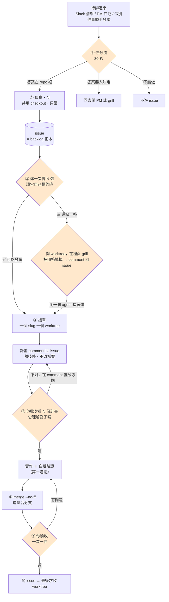

# Fleet：一次把 N 件事準備到可決策

**這份講為什麼。** 怎麼做在兩支 skill，跑一輪的打勾表在旁邊那份：

| 你要什麼 | 看哪裡 |
| --- | --- |
| 為什麼這樣設計、每一步要判斷什麼 | **這份** |
| agent 執行用的規則 | [`skills/fleet-recon`](../skills/fleet-recon/SKILL.md)（查現況）、[`skills/fleet-worktree`](../skills/fleet-worktree/SKILL.md)（實作） |
| 跑一輪、邊跑邊打勾 | [`fleet-dry-run-checklist.md`](./fleet-dry-run-checklist.md) |

> 架構來源在 work-docs：`docs/ai/agent-fleet-case-study.md`（1→1→N 案例）與
> `docs/ai/multi-agent-tools-landscape.md`（選型框架的腦／手／路）。
> 那兩份是別人的架構與選型框架，留在 work-docs；這份是**落到自己 skill 上的做法**，所以住這裡。
>
> 實測環境：Herdr 0.8.0、Claude Code 2.1.232、Ubuntu 24.04（WSL2）。

---

## 用任務系統理解它

整套就是一個任務系統。這組詞在後面通篇使用：

| 詞 | 是什麼 | 誰做 |
| --- | --- | --- |
| **偵察** | 查現況，把一件事寫成一張可以發布的任務單。**只看不動手** | `fleet-recon` |
| **任務單** | 背景 ＋ 改動範圍 ＋ **怎樣算解完**。＝ 一張 GitHub issue | 偵察寫 |
| **發布** | 看完任務單、確認它可以被接，掛上 `ready-for-agent` | **你** |
| **接單** | 拿一張已發布的任務單，在自己的 worktree 裡做完 | `fleet-worktree` |
| **驗收** | 檢查任務單上寫的「怎樣算解完」達成了沒 | e2e 或你 |

**`⚠️` 的意思是「這張任務單還缺一格」** —— 而缺的那格是**你**要填的（兩種做法都合理、要挑一個），不是偵察沒查完。查不完叫沒交件，不叫 `⚠️`。

---

## 這在解什麼問題

原本的流程是序列的：**待辦 → 我先過一層翻 repo 整理 context → 討論對齊 → 才動工。**

瓶頸不在寫 code，在「我先過一層」。一件事光是搞清楚「現在怎麼寫的、會影響到哪」就要半小時，一天能開始的事情頂多 2 件。

把那一層拆開看，它其實是兩件事：

| 在做什麼 | 佔多少時間 | 能不能平行 |
| --- | --- | --- |
| 翻 repo 看現在怎麼寫、確認影響範圍、把「功能…」對到真實檔案 | **八成** | **能** |
| 判斷這樣改對不對、要不要這樣改 | 兩成 | **不能** |

⚠️ **「判斷這樣改對不對」不能自動化，也不該自動化。** 拔掉那層就是垃圾進垃圾出。

**所以平行的是「把問題準備到可以決策的狀態」，不是「實作」。** 換算下來：原本一天只能開始 2 件事，變成一天能對齊 8 件事的決策。複雜的那幾件實作還是一件一件來 —— 這套沒有改變這點，也不打算改。

---

## 全貌

橘色是**你**，其餘讓它跑。**四個介入點每張單都會碰到，grill 只有 `⚠️` 的才有**：

| 介入點 | 你在決定什麼 | 花多久 |
| --- | --- | --- |
| ① 分流 | 這件事值不值得你花時間 | 30 秒 |
| ③ 看標籤 | 這張任務單能不能**發布** | 兩分鐘／張 |
| ⑤ 看計畫 | 它有沒有**理解對** | 10 秒～2 分鐘／張 |
| ⑦ 驗收 | 「怎樣算解完」達成了沒 | 一次一件 |
| grill | 缺的那格填什麼 | **只有 `⚠️` 的單才有** |

**③ 和 ⑤ 是兩件不同的事**，別混：③ 問「要走哪個方向」（只有你有答案），⑤ 問「你打算怎麼改」（agent 提、你審）。一張 `✅` 的單方向很明確，但它的**實作計畫**照樣可能歪。

⚠️ **grill 在 worktree 裡，但在動手之前。** 之所以先開 worktree 才 grill，是為了讓談完的那個 agent
直接變負責人 —— 不然你跟 A 談了半小時，寫進 issue，再開 B 從零讀，B 拿到結論但拿不到
「為什麼排除某案」那段推導。

---

## 三個不變量

違反其中任何一條，後面所有機制都失效。

### 1. 一個 slug 貫穿全部

**「一件事」這個單位必須落在檔案上，不能只在你腦裡。** slug ＝ **issue 編號 + 短名**，它同時決定四樣東西：

| 東西 | 長什麼樣 |
| --- | --- |
| issue | `#1769` |
| branch | `fix/1769-export-warehouse-only` |
| worktree 路徑 | herdr 自己配 |
| herdr agent name | `fix-1769-export-warehouse-only` |

**一個 slug 只准出現在一個 worktree，一個 worktree 只准有一個 agent。沒有例外。** 編號寫在 branch 名裡，所以重複做同一件事會當場現形。

（第一版沒這條，結果同一份改動被 commit 進兩條 branch —— 兩個 agent 共用一個 worktree，兩份 context 都在人腦裡搬。）

### 2. issue 是 backlog 的正本

Slack 只是入口之一。所有來源收斂到 issue，因為它同時是：**交接載體**（偵察 → 接單）、**去重指紋**、**三天後回頭看的唯一紀錄**、**PM 看得到的介面**、**slug 的來源**。

⚠️ **backlog 不要搬進 repo 當 markdown。** issue 是跨 repo 的，而 backlog 檔進 git 會讓 N 個 worktree 各改一份、**backlog 自己 merge conflict**。

⚠️ **去重指紋只有 Slack 來源有**（`Rec…` record_id）。PM 口述、順手發現的沒有 —— 那些單要嘛你自己開，要嘛派工那句話得指定用什麼關鍵字搜。**「讓 agent 自己開單」只有 Slack 那條入口是安全的。**

### 3. 問題要落在 issue 上，不能只落在 terminal 上

遇到要人決定的事 → **寫進 issue** → 然後才停。

停不是問題，**問題只印在 terminal 裡才是問題**。落在 issue 的問題你可以批次回答、三天後還讀得到、換一個 agent 接手也看得到；只印在 terminal 的，你不走過去看就不知道，而且 compact 一次就蒸發。

10 個 agent 在 3 小時內隨機打斷你 10 次是一整天沒了，10 個問題集中回答是 10 分鐘 —— **能集中是因為問題在 issue 裡**，不是因為 agent 死掉了。

⚠️ **`blocked` 是例外，而且它是對的。** 等權限核可這件事沒辦法寫進 issue，agent 就該停在那裡 —— herdr 的 `blocked` / `idle` 狀態＋`agent wait` 就是為了讓你知道「該你了」。**這條不變量跟那個機制不衝突**：狀態是通知管道，issue 是問題的存放處。

**真的該擋著等你的只有三種**：推 code、開 PR、動到別人的東西（改 Slack 表、關 issue）。

---

## ① 分流：30 秒決定「值不值得你花時間做決定」

**這步不是在做決定，是在決定這件事值不值得你花時間。** 壓在 30 秒內。

一句話版本：**答案在哪。**

| 答案在哪 | 怎麼處理 |
| --- | --- |
| 全在 repo 裡 | 直接派偵察。grep 比你快，不用給 context |
| repo ＋ 一個外部事實（後端行為、PM 文件、UI 稿） | 也派，但派工那句話要附上那個來源 |
| 答案不存在，要人決定 | 不派。grill，或回去問 PM |
| 看不懂在講什麼（`敘述` 只有「功能…」） | **回去問 PM。** 不是自己復現，也不是派 agent 猜 |
| 根本不該做 | 不進 issue，回 PM |

⚠️ **分流不查 repo。** 一旦要查就不叫分流了，那道「值不值得」的閘門會直接消失 —— 30 秒會變 30 分鐘。

**只有「看不懂在講什麼」那格能派給 agent**（它只要讀 Slack 那列，不碰 repo）。指派給你的有幾十列時，讓 agent 先掃一遍把「規格不足」的挑出來，你一次回問 PM。

### 復現是兩件事，只有一件是你的

| | 誰做 | 為什麼 |
| --- | --- | --- |
| 在畫面上確認症狀存在 | **你**（有 e2e 覆蓋的話交給它） | 你 30 秒的事。⚠️ 但「agent 開瀏覽器很慢」這個理由**看 repo 有沒有 e2e**：`frontend/e2e/auth.setup.js` 已經用 storageState 存好登入態，inventory 有 9 支 spec —— 那些地方寫一支 e2e 比你手點可靠 |
| 把症狀對應到哪段程式碼 | **偵察** | grep 比你快，而且這才是佔掉你半小時的那八成 |

所以「開瀏覽器看到問題」留著，**「猜問題在哪」丟掉** —— 你先猜了會把 agent 錨定在錯的地方。

### 四個性質：同一張尺也決定檢查點要多密

| 性質 | 白話 |
| --- | --- |
| **recurring** | 這種事會再來第二次嗎 |
| **bounded** | 做完了算不算得出來 |
| **reversible** | 做錯收得回來嗎（改 code 有 git；發訊息給 PM、關 issue 收不回） |
| **verifiable** | 對不對驗得出來嗎（測試紅、畫面看得到 → 驗得出；「體驗有沒有變好」→ 驗不出） |

| 性質狀況 | 密度 | 長什麼樣 |
| --- | --- | --- |
| **四條全中** | 稀 | 預設：分流 → 看任務單 → 看計畫 → 驗收，中間讓它跑 |
| **bounded 掉了**（步驟多、跑很久） | 密 | search → 你看 → executor → 你看 → reviewer，各自一個 pane。**這是 goal drift 的解藥** |
| **verifiable 掉了** | 密 | 同上，而且 reviewer 那關不能省 |
| **reversible 掉了** | 一定要人核可 | 見不變量 3 |

日常的 bug／需求四條全中，所以用稀的。**密的那套是例外，不是預設** —— 跨多模組的大改、沒測試覆蓋的老程式碼、第一次碰的陌生區域才划算。

> 有數字撐「跑很久就要加檢查點」：2026-07 一份終端任務 benchmark，17 個 frontier model 平均只完成 **6.4%**（最好 28.3%）；長程任務的全自主部署有 **90%** 敗在 goal drift。
>
> ⚠️ 但那個 6.4% 量的是「**拿到任務直接自主跑**」。這套流程做的就是換掉輸入 —— 接單拿到的 issue 已經有驗收條件和改動範圍，不是那種任務了。

---

## ② 偵察：查現況，寫任務單，停

**規則在 [`fleet-recon`](../skills/fleet-recon/SKILL.md)。** 這裡只講三個判斷。

### 為什麼不先開粗單

**偵察不需要 issue 編號** —— slug 是接單才需要的東西（它不開 worktree、不改檔案）。所以偵察在沒有 issue 的情況下跑，查完自己開單，任務單就是 body。你省掉「為每件事寫一次粗單」，而且 issue 一出生就有內容。

規則上也過得去：擋著等你的是推 code、開 PR、**關** issue —— **開** issue 不在裡面。

### 派工那句話只給 repo 外的東西

repo 裡的它自己找得到（`CLAUDE.md` 就是地圖，自動載入）；你指路只會限制它，指錯它會很聽話地在錯的地方找。repo 外的它一輩子找不到（PM 需求文件、prototype、UI 稿）—— 那才是要給的。

⚠️ **外部文件的路徑要登記，不要每次貼。** 踩過一次：寫死的 PM 文件路徑後來檔案搬走，連帶另外兩處引用一起爛掉，中間沒人發現。**登記處只有一個才追得動**（見〈要先準備什麼〉）。

⚠️ **不要在這一步 grill。** grill 的價值來自你手上已經有查好的現況 —— 還沒查完就 grill 等於回到那個爛順序。而且 N 個平行、每個都想討論你就是一整天沒了。

### 交付物是任務單，不是 code

**一份兩分鐘看得完的東西。** 這是解「AI 輸出不是我要的」的關鍵 —— 不是給它更多 context，是換掉它要交什麼。

body 長什麼樣照**目標 repo 的 issue 規範**（一個欄位只能有一個權威；第一版在這裡自己定了一套，結果跟 repo 規範打架、產出讀起來像 spec 的東西）。

### 收工前看工作區乾不乾淨

N 個 worker 共用同一份 checkout。**「只讀」是規則，不是強制力** —— 發生過一次：有 worker 開完 issue 沒停，繼續改了 4 個檔案，而另外 4 個正在讀同一份工作區（讀到改一半的檔案就會產出錯的結論）。

`git status --short` 不乾淨的話，**那段時間開的 issue 錨點要重驗** —— `file:line` 可能指向未提交的狀態。

---

## ③ 你的決策點：讀那個標籤

偵察每張 issue 最後一行會自己標 `✅ 可以發布` 或 `⚠️ 還缺一格`。**你 review 的其實是那個標籤。** 標錯了你馬上知道它沒搞懂，代價是兩分鐘，不是一個爛 diff。

判準跟分流同一把尺 —— **答案在哪**：

| 任務單的狀態 | 標 | 你做什麼 |
| --- | --- | --- |
| 每一格都填滿了（改動點列得完、怎樣算解完寫清楚） | `✅` | **發布** —— 掛 `ready-for-agent`，可以被接 |
| 缺一格，而且那格只有你填得出來 | `⚠️` | 進 grill 把那格填掉，然後才發布 |

### 只有一格可以空著

任務單有三格，**「大概就發」不成立** —— 空錯格子的後果不一樣：

| 格 | 可以空嗎 | 空著會怎樣 |
| --- | --- | --- |
| **現況**（改動點列得完） | ❌ | 接單的人得自己重查一遍，等於偵察白做 |
| **怎樣算解完** | ❌ **最不能空** | 接單的人不知道什麼時候算做完 —— 這就是回到「拿到任務直接自主跑」那個 6.4% 的條件。而且這欄會一路流到 PM 驗收 |
| **方向**（兩種做法都合理，要挑一個） | ✅ **只有這格** | 這才是 `⚠️`。grill 就是來填它的 |

所以退回去的判準很硬：**前兩格沒填 = 沒交件，退回去查，不是 `⚠️`。** 偵察拿「不確定」當偷懶出口的話，每張都會標 ⚠️ —— 而每張都標 ⚠️ 等於沒有標，真正需要你拍板的那幾件會被淹掉。

讀標籤之前先做 2 秒的機械檢查：**「要改哪些檔案」和「驗證指令」在不在。** 少任何一個就是還沒準備好，退回去，不用動腦。

⚠️ **驗證那欄會一路流到 PM 驗收**（`bin/slack-list ready --verify` 用的是同一份）。少了它，驗收步驟會變成實作完才現編。

### 顆粒度也在這裡決定

**有沒有兩張單其實該合成一張？** 合了才開 worktree —— 一個 slug 一個 worktree，所以幾張 `ready-for-agent` 的葉單就是幾個 worktree。這件事必須在開單／派工這一刻決定，因為 **issue 編號就是 slug**。

### grill 一次只一件，而且就開在 worktree 裡

grill 的產出是**你的判斷品質**，那個東西平行不了。三個不相關的設計討論交錯著談，你會忘記前面為什麼排除某個選項，然後在錯的前提上拍板。

判斷規則從「會不會改檔案」放寬成「**接下來會不會改檔案**」—— 標 ⚠️ 的談完大概率就要動手，一開始把 worktree 開好，談完那個 agent 就是負責人。不這樣做的代價是多一次 context 重建（B 拿到結論，拿不到「為什麼排除某案」那段推導）。

兩條防護：**grill 期間不准改檔案**（它坐在 worktree 裡，手會癢）、**結論一定要 `gh issue comment` 回去**（談話 context 一次 compact 就蒸發，三天後回頭看只有 issue）。

### label 維持兩態

**沒有 label** ＝ 還沒過目；**`ready-for-agent`** ＝ 可以派工。標 ⚠️ 的你當下就會去 grill，grill 完不是變 `ready-for-agent` 就是關掉，中間狀態活不過一天，不值得一個 label。

---

## ④ 接單：一個 slug 一個 worktree

**規則在 [`fleet-worktree`](../skills/fleet-worktree/SKILL.md)。** 這裡只講三件事。

### worktree 開不開：接下來會不會改檔案

| | 開嗎 |
| --- | --- |
| 偵察（只讀 repo、寫任務單） | ❌ 也不開 workspace |
| grill（討論本身不改檔案，但談完就動手） | ✅ 一開始開好省一次交接 |
| 接單（真的動手改） | ✅ 一個 slug 一個，沒有例外 |

⚠️ **偵察不能開 worktree 不是成本問題是循環**：worktree 要 branch 名 → 要 issue 編號 → issue 還沒開。

### 偵察 → 接單一定會換 agent

**agent 的 cwd 在 spawn 那一刻就定死**（herdr 的 `--cwd` 只在 `pane split`，`pane move` 不改 cwd）。偵察坐在共用 checkout、實作要在 worktree ⇒ 交接躲不掉。

交接的載體是 issue。✅ 的單不痛（issue 就是全部）；⚠️ 的單會掉推導，所以那幾張要把推導 comment 進去才算完。

### 只有接單需要 herdr pane

分界線是**你會不會跟它輪流講話**：會 → 一個 pane（才定址得到、才 attach 得進去）；不會 → 隨便怎麼裝。

⚠️ **用什麼裝不歸這份文件管。** subagent、獨立 pane、它自己再開一層 orchestrator —— 都行，由跑它的 code agent 決定。**只規定行為**（不介入／交完就停／不改檔案），不規定機制。層數也別再加：三層夠用，而「太早加層」是最常見的錯。

---

## ⑤ 看計畫：每張都看，但不要用互動核可

接單的 agent **先把計畫 comment 回 issue，然後停**，你批次看完才放行。

### 為什麼每張都看，不篩

想過用〈四個性質〉篩（只審 bounded 掉的），**否決了**：判斷「這張需不需要審」本身就要花你時間去想，還會漏判 —— 而那個成本跟直接掃一眼計畫差不多。

不用篩，因為**成本自動隨複雜度縮放**：

| 單的複雜度 | 計畫長什麼樣 | 你花多久 |
| --- | --- | --- |
| 簡單 | 3 行，跟 issue 的改動範圍對得上 | **10 秒放行** |
| 複雜 | 20 行，開始出現你沒想到的東西 | 2 分鐘 —— 而那正是該花的時候 |

門檻要低：你看的是「**它有沒有理解對**」，不是「這是最好的做法嗎」。理解對就放行，不然這一關會變成新的瓶頸。

### 為什麼不用 plan mode 的互動核可

| | 互動核可 | 計畫進 issue comment |
| --- | --- | --- |
| 你被打斷幾次 | **N 次**，隨機 | **0 次** |
| 怎麼看 | 一次一個，被迫切 context | 坐下來一次看 N 份 |
| 三天後查得到嗎 | ❌ 只在 terminal | ✅ 在 issue 上 |

3–6 張的話批次看是一個 5–10 分鐘的區塊，跟「一次看 N 張任務單」同一個姿勢。這也是不變量 3 的直接應用：**問題和計畫都要落在 issue 上，不能只落在 terminal 上。**

⚠️ **這一關不能用「issue 已經寫了改動範圍」取代。** issue 說的是**改哪些檔案**，計畫說的是**怎麼改** —— 前者是任務單的邊界，後者是做法。方向對、範圍對，做法照樣可以歪。

---

## ⑥ 整合分支：為什麼不能反過來

一個模組一條長命的整合分支（例如 `fix/inventory`），所有 worktree 從它開、做完 merge 回它，最後由它對 `dev` 開一個 PR。

| 規則 | 反過來會怎樣 |
| --- | --- |
| **驗收只在整合分支，一次只 merge 一件** | 兩件一起併進去壞掉，你不知道是誰 |
| **dev server 只開一個**（worktree 裡不開） | 你的注意力本來就一次一件。worktree 的平行價值在「agent 同時在寫」，不在「你同時在測」 |
| **兩道關**：agent 自己過測試 / lint / typecheck + `git diff --name-only` 對照範圍，才輪到第二道 | 少了第一道，驗收時間會浪費在 agent 自己驗得出來的東西上 |

⚠️ **第二道關是「驗收」，不是「人測」—— 誰執行是實作細節。** 判準只有一個：
**任務單上寫的「怎樣算解完」有沒有達成。** 執行者可以是：

| 誰驗 | 什麼情況 |
| --- | --- |
| **e2e** | 功能對不對、流程有沒有斷。有覆蓋就該讓它擋，比你手點可靠而且會擋第二次 |
| **你** | UI/UX 的主觀判斷（間距、語意、順不順）—— 這個目前沒得外包 |

現在大部分是你手測，那是**現況不是原則**。凡是「解完的定義」寫得出可執行的檢查，
就該往 e2e 走 —— 那也是唯一能讓「驗收」不再是你的瓶頸的方向。
| **`merge --no-ff`** | 整合測試掛掉時，一顆 merge commit 一個工作單位，`git revert -m 1 <sha>` 就能打回乾淨。而且整合分支最後會被 squash 進 `dev`，保留歷史的代價是零 |
| **測到問題回原 worktree 改，不要 revert** | revert 掉一顆 merge commit 之後再 merge 同一條 branch，git 認為那些 commit 併過了、內容不會回來 |
| **worktree 最後才收** | 整合測試沒過你要回去修，先收掉就得重開重裝 |
| **子 branch 一律不 push** | 會在 GitHub 累積一堆永遠不開 PR 的分支 |
| **其他還在跑的 worktree 不要動** | 在 agent 做到一半改它的 base，它腦裡的檔案狀態會跟磁碟對不上 |

### handoff 是快照，issue 才是權威

`gh issue view > .claude/handoff.md` 抓完就定住了，而 grill 結論要 comment 回 issue —— 落差保證會發生。兩種，解法不同：

- **compact 之後失憶** → 它會回頭讀舊快照。靠 `CLAUDE.local.md` 身分卡（活過 compact）。
- **跨 slug**（A 單的決定影響 B 單）→ **留 comment 的那一方順手通知**，成本零。

⚠️ 不要叫 agent 定期輪詢 issue —— 落差是「留 comment」造成的，訊號就從那裡發。

---

## 分層換到什麼，代價是什麼

| 換到 | 代價 |
| --- | --- |
| **context 隔離** —— 每個 worker 只裝一件事，不會第 4 件開始混淆前面的 | 回傳值還是會進總管理的 context，所以**任務單要寫進 issue、回傳只給一行編號**，否則等於又壓成一個 session |
| **拆解的決定權下放** —— 「這件事要不要拆成 3 個工人」由負責人判斷 | 你看不到它內部怎麼拆 |
| **你的介入點在負責人層** —— 跟「負責這件事的人」講話，不是跟 search 工人講話 | 偵察你不能介入（那是刻意的） |
| **一次性探索免費** —— 拋棄式 context 燒掉細節，只回結論 | **零攤銷**：重複的類似查詢每次都從零開始。所以規則是「**一次性的探索用 worker；會被問第二次的，寫進檔案**」 |

⚠️ **「pane 的 context 可以複用」是假的優勢。** 留著的 context 會劣化（goal drift），留越久混越厲害。**真正可複用的東西應該在檔案裡，不在誰的 context 裡。**

**錢**：查資料階段用便宜模型（它只是在 grep 和讀檔），你決策完之後的實作階段才換貴的。
總 token 量確實比單一 session 多，但每個 worker 的 context 是乾淨的、只裝一件事 —— 那才是省下你時間的原因。

⚠️ **不要把別的 repo 整包塞給 agent。** 開一個拋棄式 worker 去查、只帶結論回來（「查退貨 API 還回不回供應商欄位，只回答有/沒有 + 檔案路徑行號」）。整包給它會迷路，而且 context 燒光。

---

## 要先準備什麼

### 不用準備的

- **不用告訴 agent 去哪找程式碼。** grep 和 glob 它比你快。
- **不用建「代號 → 模組 → 路徑」對照表。** issue 標題前綴已經在做這件事，再開一份就是第二套會過期的東西。
- **不用建 repo 清單。** `ls ~/code` 就是清單，而且自我維護。缺的是**各 repo 的自我描述**（`CLAUDE.md`）。
- **不用建 `backlog/` 目錄。** issue 就是 backlog。

### `~/code/CLAUDE.md`

**repo 外的東西登記在這裡，不寫在派工那句話裡。** 它會被 `~/code` 底下每個 session 自動載入（Claude Code 沿目錄樹往上讀 `CLAUDE.md`），所以登記一次全部 agent 都看得到。

放：**repo 之間的配對關係**（哪個模組對哪個後端 repo）、**repo 外權威文件的位置**。
不放：任何單一 repo 內部的規則、任何會過期的行為結論。

⚠️ 不要叫它 `MAP.md` —— 那個名字沒有任何機制會讓它被讀到。
⚠️ 它由所有 session 付 token，只列真的在跑的那幾個 repo。

### 目標 repo 的兩個前置

- **`.gitignore` 要有 `CLAUDE.local.md`**，否則接單寫的身分卡會汙染偵察的守門訊號。
- **`CLAUDE.md` 觸發表要有「決定要開單時 → 讀 issue 規範」**。措辭要涵蓋**規劃階段** —— 寫「開 / 改 issue 時讀」會被讀成「執行 `gh issue create` 那一刻才讀」，於是規劃「要開幾張」時沒讀到。實測踩過。

### 指紋（Slack 來源）

開單前比對，命中就不要開：`gh issue list --search "Rec0B…" --state all`。沒命中才開，issue body **第一行**放一句看得見的來源。

⚠️ **指紋要看得見，不要藏在 HTML 註解裡。** GitHub 搜尋會不會索引註解沒有定論，整套去重就靠這個查詢。
⚠️ **不要靠 GitHub 原生的重複偵測。** 官方說明只講網頁表單，沒講 `gh issue create` 走不走得到。

---

## 現況與待辦

- **`bin/fleet` script 還沒寫。** 第一件該包進去的是接單的 bootstrap，不是 spawn —— spawn 手打很快，環境沒起來才是每次都卡住的地方。
- **調度層：架構定了，實作還沒。** 形狀是「總管理 pane + 它自己開的偵察」，但還是手動開 session。
- **三個新機制還沒驗過**：終止條件、`git status` 守門、`CLAUDE.local.md` 身分卡。用 checklist 跑一輪。
- **orchestrator 工具還沒選。** 兩條路都沒試：`~/.claude/agents/*.md` 自訂角色（零依賴，但 `.claude/` 被 gitignore ⇒ 不能共享），或 `oh-my-opencode-slim`（七角色 + 自動開 pane，Herdr 整合需 0.8.0+，支援 Claude Code 不是 opencode 專屬）。**先用一張最機械的 ✅ 單做 A/B**，不要整批換。
- **`~/code/CLAUDE.md` 還沒建。**
- **策略層（日記 agent）先不做。** 那層管「你有沒有在做對的事」，等這層跑順再說。

### 從哪開始

**不要一開始就開 10 個，從 2–3 個開始。你的瓶頸不是 agent 的速度，是你自己審核的速度。**

1. 先把〈要先準備什麼〉那三個前置做完
2. 拿一件真的待辦，叫 `fleet-recon` 跑一次，看任務單產得對不對
3. 把 `✅` / `⚠️` 的判準調到你信得過 ← **這步最值錢**
4. 才寫 script 把 spawn 自動化
